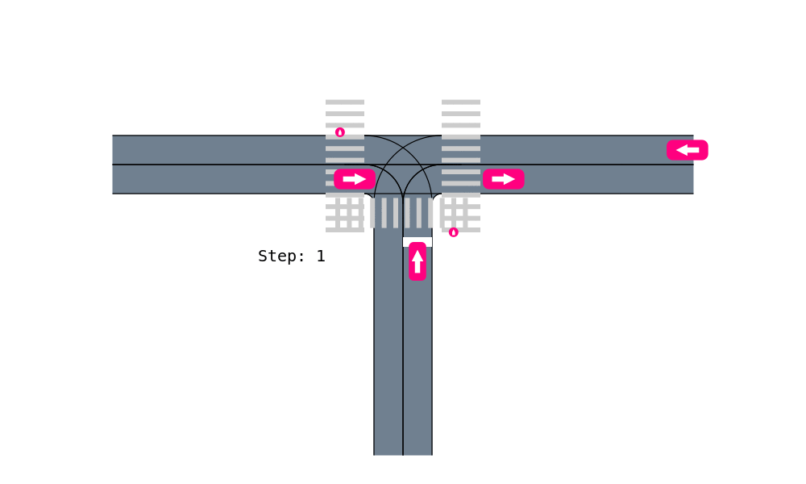

# AutomotivePOMDPs: Driving Scenarios formulated as POMDPs

[](https://travis-ci.org/sisl/AutomotivePOMDPs.jl)
[](https://coveralls.io/github/sisl/AutomotivePOMDPs.jl?branch=master)
[](https://sisl.github.io/AutomotivePOMDPs.jl/latest)

contact: Maxime Bouton, [boutonm@stanford.edu](boutonm@stanford.edu)

This repository consists of different driving scenarios formulated as POMDPs. It provides a generative model for computing policies. A few of them have explicit transition and observation models.

## Installation

To install this package, first add the SISL registry and the JuliaPOMDP registry such that all dependencies are automatically installed. 
You can run the following in the julia REPL:
```julia 
using Pkg
Pkg.add("POMDPs")
using POMDPs
POMDPs.add_registry()
Pkg.Registry.add("https://github.com/sisl/Registry")
```

## Code to run

Run `docs/Urban POMDP tutoial.ipynb` for a visualization of the simulation environment.

## Scenarios

This package exports the following POMDP Models:
- `SingleOCPOMDP`: Occluded crosswalk with one single pedestrian. Discrete states and observations with explicit transition and observation model.
- `SingleOIPOMDP`: Occluded intersection with one single car. Discrete states and observations with explicit transition and observation model.
- `OCPOMDP`: Occluded crosswalk with a flow of pedestrian. Generative model implementation with continuous state and observations
- `OIPOMDP`: Occluded T intersection with a flow of cars driving in multiple lanes. Generative model implementation with continuous state and observations
- `UrbanPOMDP` : Occluded T intersection with crosswalks, flow of cars and pedestrians. Generative model implementation with continuous state and observations

These models are defined according to the [POMDPs.jl]() interface. To see how they are parameterized, toggle the documentation using `?` or
use the function `fieldnames` if documentation is not yet written.

Video of the `UrbanPOMDP` scenario:


## Dependencies

- AutomotiveDrivingModels.jl
- POMDPs.jl
